# Portfolio Deployment Automation using GitHub Actions & AWS S3

This project demonstrates **CI/CD automation for a static portfolio website** using **GitHub Actions and AWS S3 Static Website Hosting**.

Whenever changes are pushed to the GitHub repository, **GitHub Actions automatically deploys the updated files to an S3 bucket**, making the website live without manually uploading files.

---

# ➤ Architecture Diagram

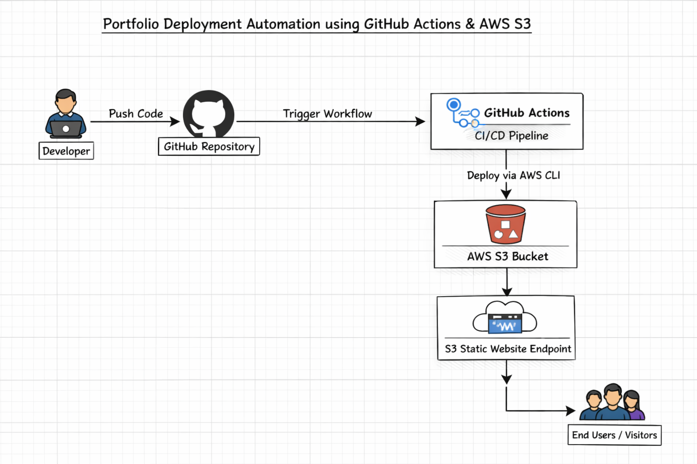

---

# ➤ Technologies Used

- AWS S3 (Static Website Hosting)
- AWS IAM
- GitHub
- GitHub Actions (CI/CD)
- HTML
- CSS

---

# ➤ Project Structure

```
portfolio-automation-using-GitHub-Actions
│
├── .github
│   └── workflows
│       └── deploy.yml
│
├── index.html
├── style.css
├── profile.png
├── profile2.jpeg
├── aws-badge.png
├── Prutha_Dongre_resume.pdf
└── portfolio.txt
```

---

# ➤ Step 1 — Create S3 Bucket

1. Go to **AWS Console**
2. Open **S3**
3. Click **Create Bucket**
4. Enter bucket name
5. import files

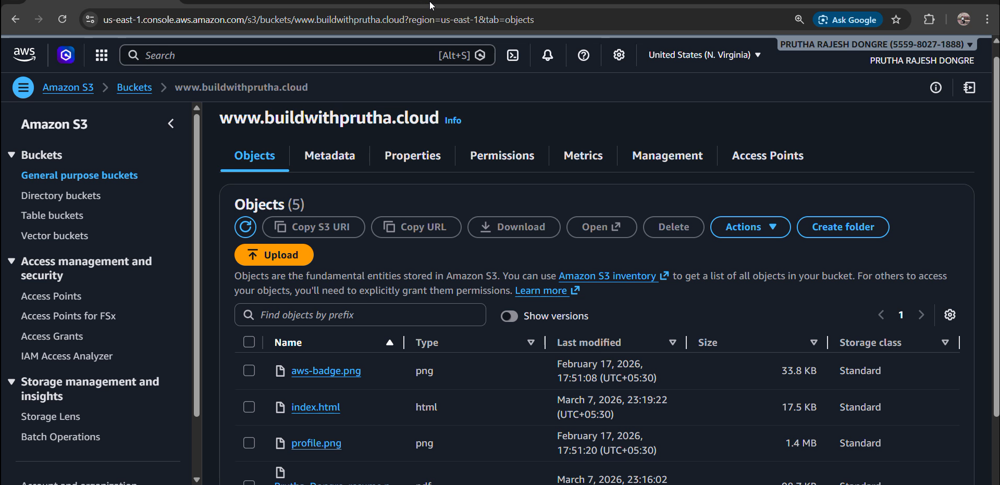

---

# ➤ Step 2 — Attach Bucket Policy

Disable **Block Public Access** and attach the following policy:

```json
{
  "Version": "2012-10-17",
  "Statement": [
    {
      "Sid": "PublicReadGetObject",
      "Effect": "Allow",
      "Principal": "*",
      "Action": "s3:GetObject",
      "Resource": "arn:aws:s3:::www.buildwithprutha.cloud/*"
    }
  ]
}
```

This policy allows the public to access files from the S3 bucket.

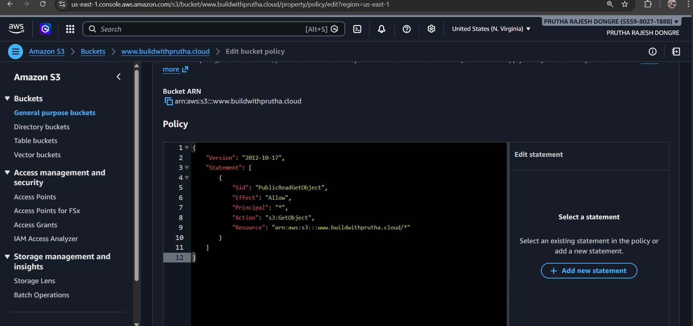

---

# ➤ Step 3 — Enable Static Website Hosting

Go to:

```
Bucket → Properties → Static Website Hosting
```

Enable hosting and configure:

```
Index document: index.html
```

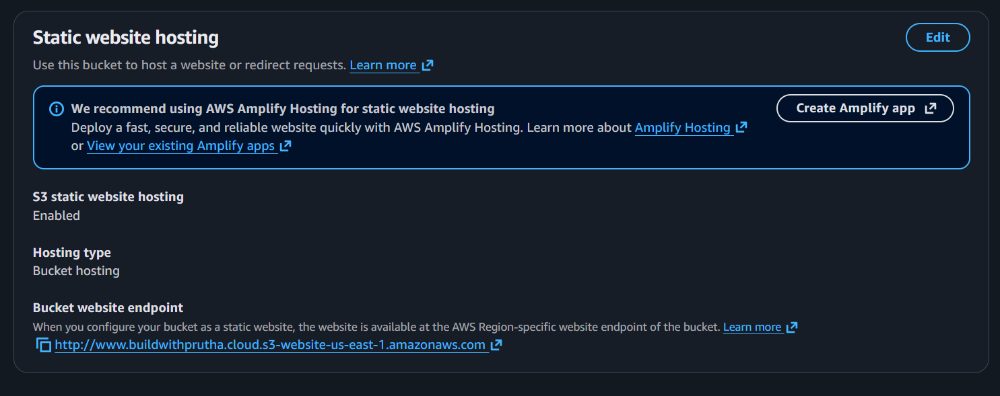

---

# ➤ Step 4 — Create IAM User

1. Go to **IAM → Users**
2. Click **Create User**
3. Name the user:

```
github-actions
```

4. Attach permission policy:

```
AmazonS3FullAccess
```

5. Create **Access Key**

Save:

```
AWS Access Key ID
AWS Secret Access Key
```

These credentials will be used by **GitHub Actions** to deploy files.

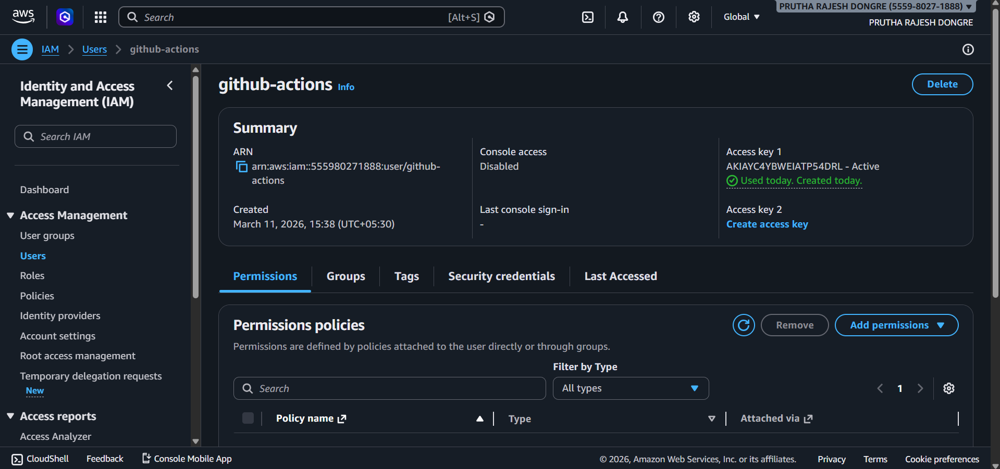

---

# ➤ Step 5 — Create GitHub Repository

Create repository:

```
portfolio-automation-using-GitHub-Actions
```

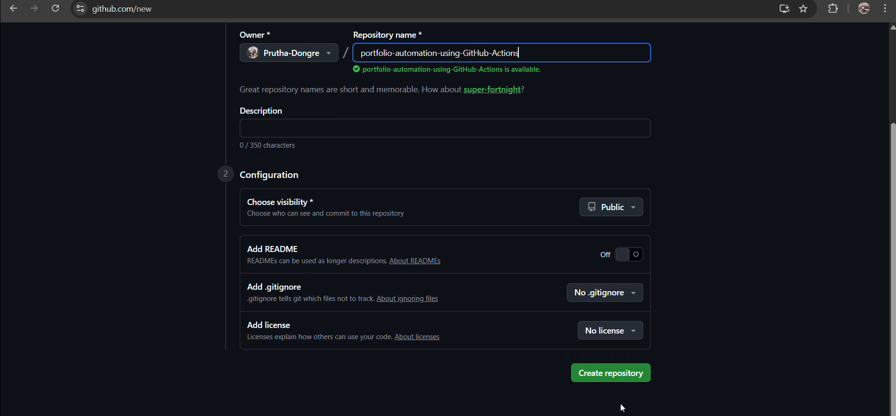

Push your portfolio code:

```bash
git init
git add .
git commit -m "adding portfolio to repo"
git remote add origin https://github.com/<username>/portfolio-automation-using-GitHub-Actions.git
git push origin master
```

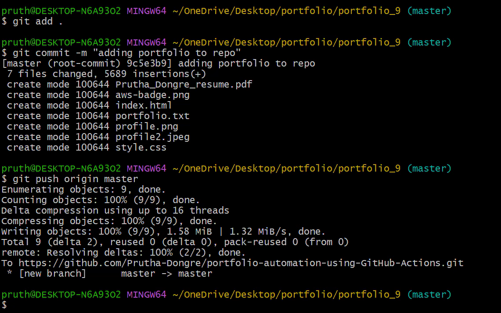


---

# ➤ Step 6 — Add GitHub Actions Workflow

Create file:

```
.github/workflows/deploy.yml
```

Add the following configuration:

```yaml
name: Deploy Portfolio to S3

on:
  push:
    branches:
      - master

jobs:
  deploy:
    runs-on: ubuntu-latest

    steps:
      - name: Checkout repository
        uses: actions/checkout@v4

      - name: Configure AWS credentials
        uses: aws-actions/configure-aws-credentials@v4
        with:
          aws-access-key-id: ${{ secrets.AWS_ACCESS_KEY_ID }}
          aws-secret-access-key: ${{ secrets.AWS_SECRET_ACCESS_KEY }}
          aws-region: ${{ secrets.AWS_REGION }}

      - name: Deploy to S3
        run: |
          aws s3 sync . s3://${{ secrets.S3_BUCKET }} \
            --delete \
            --exclude ".git/*" \
            --exclude ".github/*" \
            --cache-control "max-age=0,no-cache,no-store,must-revalidate"

```

This workflow automatically deploys code to S3 whenever changes are pushed.

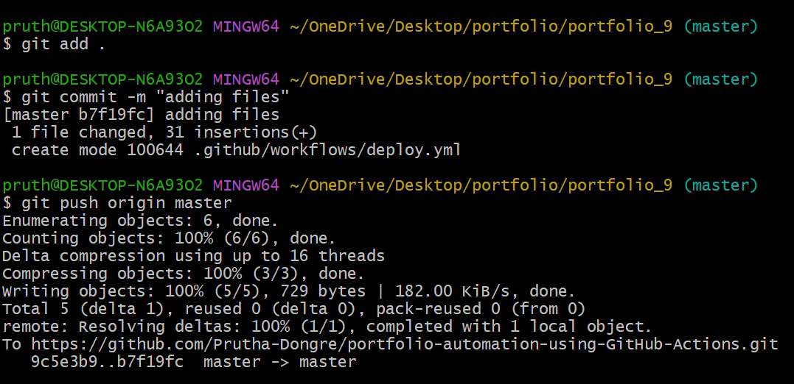

---

# ➤ Step 7 — Create GitHub Repository Secrets

Go to:

```
Repository → Settings → Secrets and Variables → Actions
```

Create the following secrets:

| Secret Name | Value |
|--------------|------|
| AWS_ACCESS_KEY_ID | IAM Access Key |
| AWS_SECRET_ACCESS_KEY | IAM Secret Key |
| AWS_REGION | bucket region |
| S3_BUCKET | bucket name |

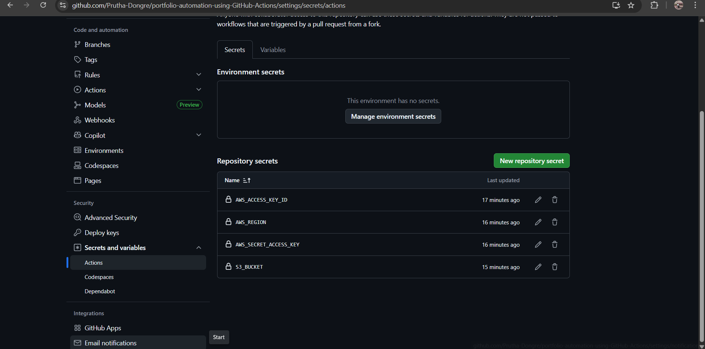

---

# ➤ Step 8 — Before Changing anything check bucket endpoint

Before:

```
I'm Prutha Dongre
```

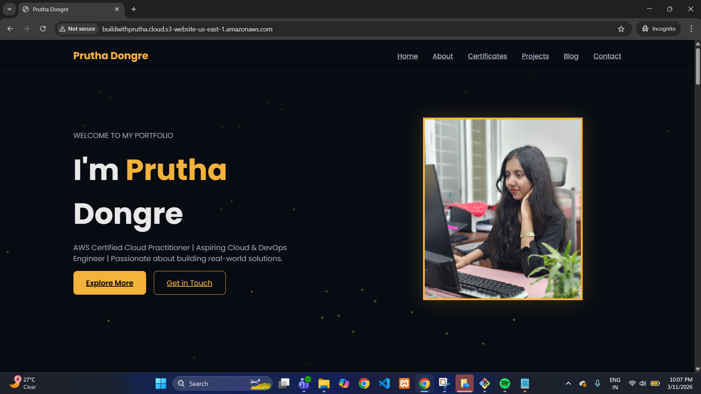

---


# ➤ Step 9 — Modify Code and Push Changes

Edit the **index.html** file.

Commit and push:

```bash
git add .
git commit -m "modified index file"
git push origin master
```

This will automatically trigger the **GitHub Actions pipeline**.

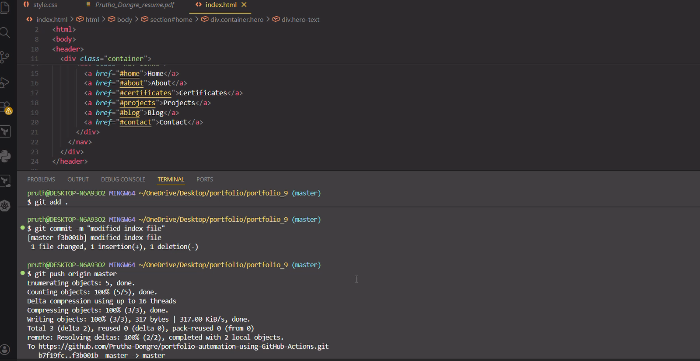

---

# ➤ Step 10 — Verify Deployment and Compare Before And After

After:

```
My Name is Prutha Dongre
```

Check the website using the S3 website endpoint:


You should see the updated website with the new changes.


---

# ➤ Result

✔ Static portfolio hosted on AWS S3  
✔ Automated deployment using GitHub Actions  
✔ CI/CD pipeline implemented  
✔ Automatic updates after every Git push  

---

# ➤ Troubleshooting

###  Website not loading

Check:

- Static website hosting is enabled
- `index.html` is configured correctly
- Bucket policy allows public access

---

###  Access Denied Error

Ensure:

- Block Public Access is disabled
- Bucket policy includes `s3:GetObject`

---

###  GitHub Actions Workflow Failed

Verify:

- Repository secrets are correct
- AWS Access Key and Secret Key are valid
- IAM user has **S3 permissions**

---

###  Changes not reflecting on website

Try:

- Hard refresh (`Ctrl + Shift + R`)
- Wait a few seconds for deployment to complete
- Check **GitHub Actions logs**

---

# ➤ Summary

This project demonstrates how to build a **simple CI/CD pipeline for a static website** using GitHub Actions and AWS S3.

Key highlights of the project:

- Static website hosted on **AWS S3**
- **GitHub Actions CI/CD pipeline** for automatic deployment
- Secure access using **IAM user and repository secrets**
- Automatic updates whenever code is pushed to GitHub

This project helps understand **DevOps fundamentals like automation, cloud deployment, and CI/CD pipelines**.

---

